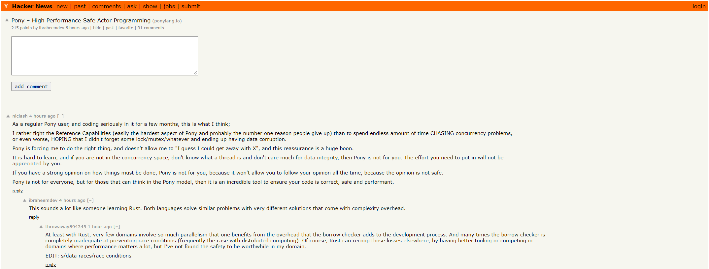
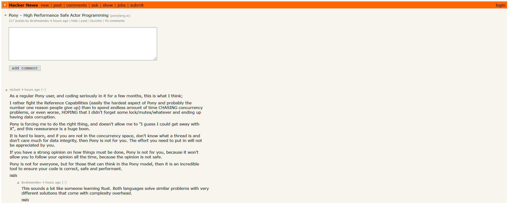

# readable_hn

## About

**readable_hn** is a browser extension that provides minor readability improvements to Y Combinator's Hacker News forum while maintaining the minimalist styling. To do so, it changes the comments styling in the following ways:

- Increases the comment font size from 9 to 12 for less eyestrain
- Decreases the comment `max-width` for a more article-like reading experience

## Why

I find the original font size strains my eyes. Also, I tend to skim through forum comments almost vertically. So keeping the width of the text body more narrow makes skimming feel more natural on the HN site.

## Example

### Before

Text is smaller, and lines stretch more than halfway across the computer screen

### After

Text is slightly larger, but not overwhelmingly. Lines break sooner, replicating the feel of a book or e-reader.

## Disclaimer

**readable_hn** is not affiliated with Y Combinator in any way, and is only meant as an independent improvement to site readability according to personal preference.